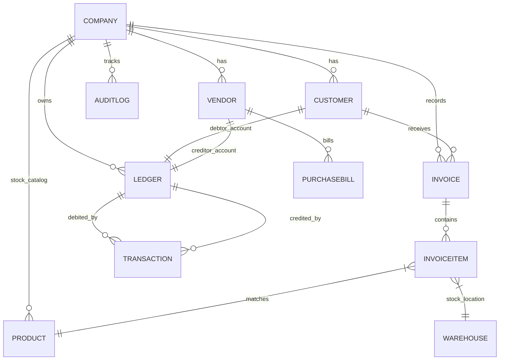
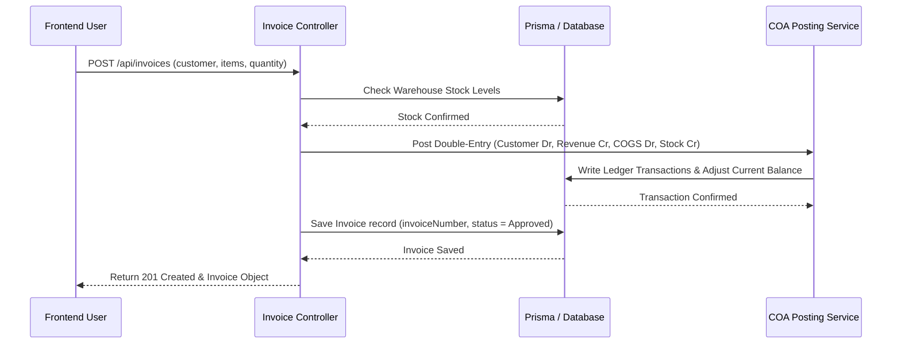
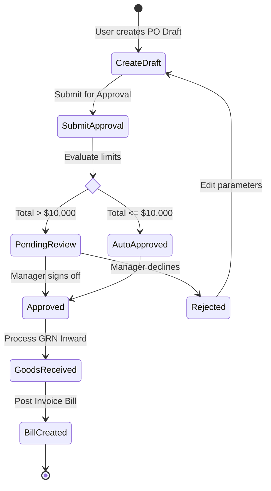
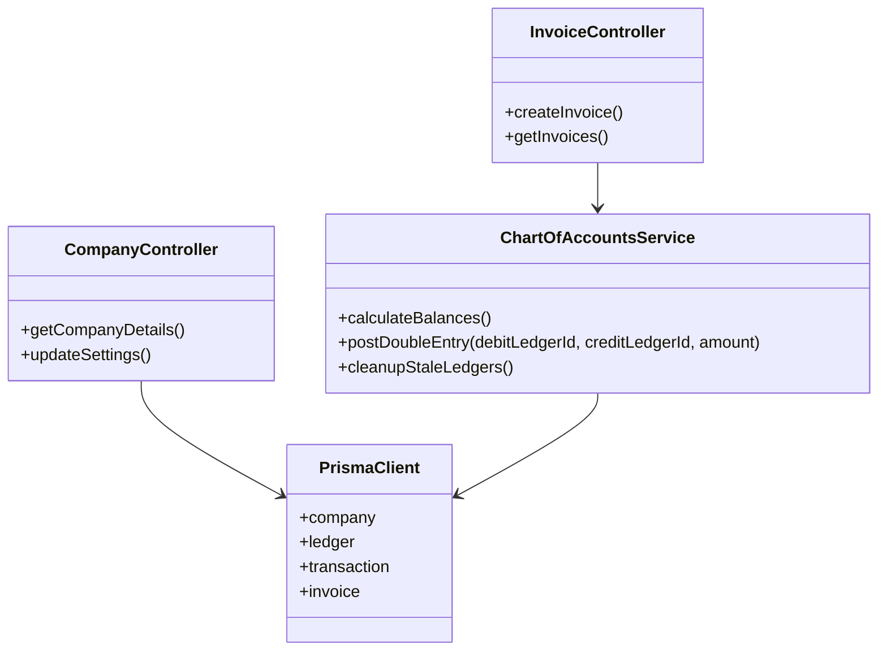
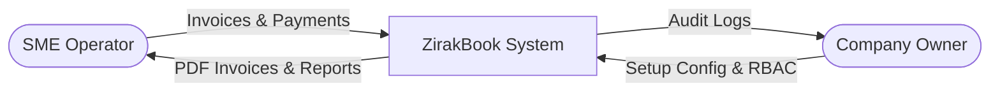
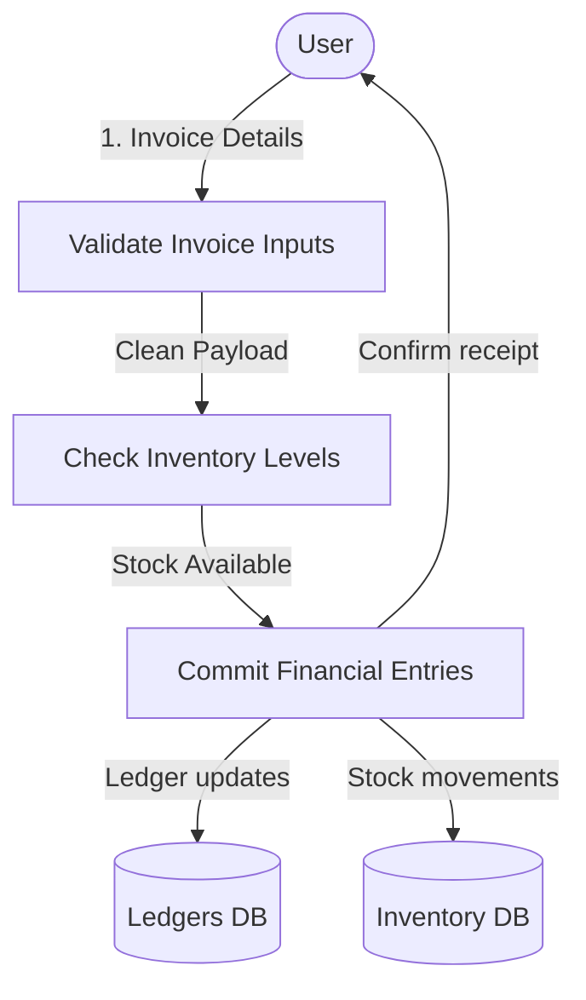
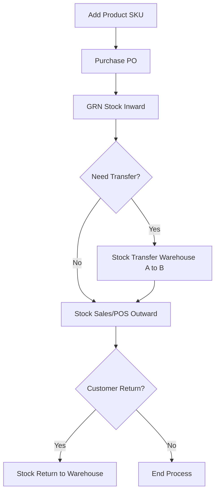

# ZirakBook ERP - Master Documentation Suite
This document provides the complete, end-to-end technical, business, functional, and operational documentation for the **ZirakBook ERP** application.

---

## Table of Contents
1. [Business Requirement Document (BRD)](#1-business-requirement-document-brd)
2. [Functional Requirement Specification (FRS)](#2-functional-requirement-specification-frs)
3. [Module Overview](#3-module-overview)
4. [End-to-End Business Workflow](#4-end-to-end-business-workflow)
5. [Screen Flow (Navigation Flow)](#5-screen-flow-navigation-flow)
6. [State Flow](#6-state-flow)
7. [State Transition Rules](#7-state-transition-rules)
8. [Business Rules](#8-business-rules)
9. [Validation Rules](#9-validation-rules)
10. [Role & Permission Matrix (RBAC)](#10-role--permission-matrix-rbac)
11. [API Documentation](#11-api-documentation)
12. [Database Documentation](#12-database-documentation)
13. [Entity Relationship Diagram (ERD)](#13-entity-relationship-diagram-erd)
14. [Sequence Diagrams](#14-sequence-diagrams)
15. [Activity Diagrams](#15-activity-diagrams)
16. [Use Case Diagrams](#16-use-case-diagrams)
17. [Class Diagrams](#17-class-diagrams)
18. [Data Flow Diagrams (DFD)](#18-data-flow-diagrams-dfd)
19. [System Architecture](#19-system-architecture)
20. [Authentication & Authorization Flow](#20-authentication--authorization-flow)
21. [Inventory Flow](#21-inventory-flow)
22. [Accounting Flow](#22-accounting-flow)
23. [Sales Flow](#23-sales-flow)
24. [Purchase Flow](#24-purchase-flow)
25. [Notification Flow](#25-notification-flow)
26. [Audit Log Flow](#26-audit-log-flow)
27. [Error Handling Flow](#27-error-handling-flow)
28. [Edge Cases](#28-edge-cases)
29. [Test Cases](#29-test-cases)
30. [Test Data](#30-test-data)
31. [Bug Reporting Format](#31-bug-reporting-format)
32. [Performance Requirements](#32-performance-requirements)
33. [Security Requirements](#33-security-requirements)
34. [Deployment Architecture](#34-deployment-architecture)
35. [Complete User Manual](#35-complete-user-manual)

---

## 1. Business Requirement Document (BRD)

### Business Purpose
ZirakBook ERP is a multi-tenant, double-entry financial accounting and real-time inventory management platform designed to streamline business operations for small to medium enterprises (SMEs). It connects operational transactions (sales, purchases, point-of-sale, expenses) directly with double-entry general ledgers and warehouses, providing accurate, real-time financial and stock analysis.

### Problem Statement
SMEs struggle with fragmented software systems where sales billing, inventory status, and core accounting are managed in isolation. This leads to:
*   Mismatched stock numbers and financial figures (e.g., inventory assets do not balance with stock physical values).
*   Manual, error-prone entries for ledger postings.
*   Lack of real-time audit logs and user activity tracking, leading to operational leakages.
*   Difficulty handling credit terms, tax (GST) rules, and multi-warehouse logistics.

### Objectives
*   **Unified Ledger Syncing**: Ensure every invoice, payment, purchase bill, and returns transaction automatically generates balancing double-entry ledger entries.
*   **Multi-Warehouse Inventory Tracking**: Maintain real-time average cost calculation and batch tracking across multiple physical locations.
*   **Security & Traceability**: Ensure strict role-based access control (RBAC) and record all data-modifying operations inside an immutable audit log.
*   **SaaS Multi-Tenancy**: Support subscription plans with strict bounds on users, companies, storage, and transaction limits.

### Scope
*   **In Scope**: User authentication with JWT; Multi-company setups; Chart of Accounts configurations; Sales and Purchase cycles; POS module; Warehouse management; Vouchers (Receipt, Payment, Contra, Journal); Standard reporting (P&L, Balance Sheet, Ledger Report, Trial Balance); Audit logs.
*   **Out of Scope**: Multi-currency conversion for individual lines (base currency matches company-level configuration); Automated third-party logistics integrations (shipping carriers are tracked manually).

### Stakeholders
*   **Super Admins**: Monitor active SaaS plans, manage plan requests, and run platform adjustments.
*   **Company Owners / Admins**: Configure company details, terms, manage team roles, and review end-to-end accounting.
*   **Accountants**: Post journal entries, audit ledger accounts, configure tax rates, and review trial balances.
*   **Sales/Inventory Executives**: Manage point-of-sale terminals, raise quotations, dispatch delivery challans, and record goods arrivals.

---

## 2. Functional Requirement Specification (FRS)

### Feature Description
ZirakBook translates sales and purchase transactions into structured double-entry ledger accounts:
*   **Sales**: Supports Sales Quotations, Sales Orders, Delivery Challans, Invoices, Payments, and Returns.
*   **Purchases**: Supports Purchase Orders, Goods Receipt Notes (GRN), Purchase Bills, and Vendor Payments.
*   **Double-Entry Posting**: Updates Customer ledger (Debit/Credit), Accounts Receivable, Cost of Goods Sold (COGS), Revenue, and Inventory Asset ledgers in real-time.

### Functional Requirements
*   **FR-1 (Auth)**: Users can register, log in, request passwords, and access companies based on granted roles.
*   **FR-2 (COA)**: Standard Account Groups (Assets, Liabilities, Equity, Revenue, Expenses) and subgroups must auto-initialize upon company creation.
*   **FR-3 (Inventory)**: Average cost and total quantities must update automatically on GRNs, Invoices, and Adjustments.
*   **FR-4 (Sales/Purchases)**: Support document states: Draft, Pending, Approved, Completed, Cancelled. Allow creation of invoices from orders or challans.
*   **FR-5 (POS)**: Cashier-focused offline-capable billing screen that reduces inventory and logs sales receipts immediately.

### Non-Functional Requirements
*   **NFR-1 (Security)**: All endpoints except `/auth/login` and plan requests require validated JWT tokens. Passwords must be hashed using bcryptjs.
*   **NFR-2 (Performance)**: Page loading and basic reports (P&L) should generate within 1.5 seconds under standard database sizes (< 100,000 transactions).
*   **NFR-3 (Reliability)**: Database mutations in sales or purchases must run inside transaction blocks to prevent partial ledger entries.

### Acceptance Criteria
*   An invoice total of $500 with $300 product cost must log:
    *   Accounts Receivable Debit (+500)
    *   Sales Revenue Credit (+500)
    *   COGS Debit (+300)
    *   Inventory Asset Credit (+300)
*   A user cannot bypass credit terms or spend past negative stock limits unless specifically authorized in the company inventory settings.

---

## 3. Module Overview

| Module Name | Purpose | Key Features | Dependencies | Inputs | Outputs |
| :--- | :--- | :--- | :--- | :--- | :--- |
| **Authentication** | Manage system access | JWT login, role validation | User, Company, Role tables | Credentials | JWT token, Session state |
| **Chart of Accounts** | Maintain double-entry ledger system | Group/Subgroup creation, balance calculations | Company, Ledger models | Ledger configurations | Account hierarchy |
| **Customers & Vendors** | Track counterparty profiles and ledgers | Debtors/Creditors ledger mapping, contact details | Company, Ledger | Profile data, Opening Balances | Customer/Vendor Profile |
| **Sales (Orders/Invoices)** | Manage sales invoicing | Quotations, orders, invoice generation, payment allocation | Customer, Warehouse, Products | Items, Rates, Taxes | Invoice PDF, Ledger updates |
| **Purchases (Bills/GRNs)** | Document vendor arrivals | Goods receipt note matching, invoice verification, bill postings | Vendor, Warehouse, Products | Quantities, Purchase Rates | GRN, Purchase Bill, Stock addition |
| **Inventory Manager** | Manage stock valuations | Stock Transfers, Adjustments, Average costing | Product, Stock, Warehouse | Quantity offsets, Locations | Stock balance sheet |
| **POS Module** | Rapid counter sales | Quick product search, instant payment mapping, receipt print | Customer, Product, Warehouse | POS items selection | Paid POS Invoice, Receipt |
| **Voucher System** | Log manual entries | Payment, Receipt, Contra, Journal voucher entries | Ledgers, Bank Accounts | Debit/Credit targets, amount | Signed Journal Entry |
| **Reports Engine** | Financial statements | P&L, Balance Sheet, Ledger report, Trial Balance, GST reports | Transaction, Ledgers | Date range filters | Statement sheets (Excel/PDF) |

---

## 4. End-to-End Business Workflow

### Sales Workflow
```
[Quotation] -> [Sales Order] -> [Delivery Challan] -> [Sales Invoice] -> [Sales Payment (Receipt)] -> [Sales Return (Refund/Credit Note)]
```
1.  **Sales Quotation**: Drafted for customer review. No financial or stock impact.
2.  **Sales Order**: Quotation accepted. Stock is committed but not yet deducted.
3.  **Delivery Challan**: Items are physically dispatched from a specified warehouse. Stock decreases.
4.  **Sales Invoice**: Generated against the Challan or Order. Triggers accounts receivable ledger posting.
5.  **Receipt**: Customer pays the invoice. Cash/Bank ledger increases, customer accounts receivable ledger decreases.
6.  **Sales Return**: Customer returns items. Stock updates, Cash/Credit note updates ledger.

### Purchase Workflow
```
[Purchase Order] -> [Goods Receipt Note (GRN)] -> [Purchase Bill] -> [Vendor Payment] -> [Purchase Return]
```
1.  **Purchase Order**: Ordered from vendor. No ledger updates.
2.  **GRN**: Items physically arrive. Inventory Asset account debited, Stock Inward ledger credited (Accrual). Stock increases.
3.  **Purchase Bill**: Received vendor invoice. Accounts Payable credited, Stock Inward debited.
4.  **Vendor Payment**: Cash/Bank account credited, Vendor accounts payable debited.

### Inventory Workflow
```
[Stock Addition] -> [Stock Transfer (Warehouse A to B)] -> [Physical Audit] -> [Inventory Adjustment]
```

### Accounting Workflow
```
[Operational Transaction] -> [Automatic Journal Posting] -> [Double-Entry Ledger Updates] -> [Trial Balance Check] -> [Financial Statement Generation]
```

---

## 5. Screen Flow (Navigation Flow)

### Screen Flow Map
```
                [Login Page]
                     │
              [Dashboard Home]
    ┌────────────────┼────────────────┐
    ▼                ▼                ▼
[Sales Hub]    [Purchase Hub]   [Finance Hub]
    │                │                │
    ├─ Quotations    ├─ Vendor Orders ├─ Ledgers
    ├─ Orders        ├─ GRN Inward    ├─ Bank Accounts
    ├─ Invoices      ├─ Purchase Bills├─ Vouchers
    └─ Returns       └─ Payments      └─ Reports
```

### Navigational Logic & Button Flows
1.  **Dashboard Hub**: Clicking top-left company profile navigates to **Settings** (`/settings`).
2.  **Create Invoice Flow**: Navigating to `Sales -> Invoices -> New Invoice`. Selecting a Customer prompts credit limits. Clicking "Save Invoice" redirects back to Invoice details and triggers a "Print PDF" modal.
3.  **POS Direct checkout**: POS terminal stays locked on `/pos`. Checkout actions open the "Change amount due" popup and immediately clear for the next customer when clicking "Done".
4.  **Redirect Rules**: If the JWT token expires, the interceptor forces a redirect to `/login`.

---

## 6. State Flow

Every document (Invoices, Orders, Challans, Payments) follows a dedicated state system:

```
                  ┌─────────[ Draft ]──────────┐
                  │                            │
                  ▼                            ▼
             [ Pending ]                  [ Cancelled ]
                  │
         ┌────────┴────────┐
         ▼                 ▼
    [ Approved ]      [ Rejected ]
         │
         ▼
   [ Completed ]
```

*   **Draft**: Editable document; no ledger impact, no stock impact.
*   **Pending**: Sent for verification. Awaiting approval.
*   **Approved**: Financial and stock impact validated and recorded. Ledgers posted.
*   **Rejected**: Document declined. No financial impact.
*   **Completed**: Fully paid (Invoices) or fully received (PO/GRN).
*   **Cancelled**: Struck off. Posting entries are reversed.

---

## 7. State Transition Rules

| Source State | Target State | Authorized Role | Conditions |
| :--- | :--- | :--- | :--- |
| **Draft** | **Pending** | Any role | All mandatory fields populated |
| **Pending** | **Approved** | Admin, Accountant | Total amount matches lines, credit validation passed |
| **Pending** | **Rejected** | Admin, Accountant | Rejection notes provided in remarks field |
| **Approved** | **Completed** | System Trigger | Balance Amount reaches 0 (full payment recorded) |
| **Approved** | **Cancelled** | Admin | No subsequent documents linked (e.g. Invoice cannot be cancelled if payment is attached) |

---

## 8. Business Rules

### Credit Limit Policy
*   Each Customer has a configured `creditLimit`.
*   During checkout or Invoice creation: If `customerCurrentBalance + newInvoiceAmount > creditLimit`, the system throws a warning or prevents invoice submission based on settings.

### Negative Stock Enforcement
*   If `negativeStockAllowed = false` under company configuration:
    *   System checks `warehouseStock` during Invoice, Delivery Challan, or POS entry.
    *   Transaction block fails with `Insufficient stock at Warehouse X` if requested quantity exceeds current quantity.

### Tax (GST) Posting Rules
*   If `gstEnabled = true`:
    *   If Customer/Vendor state matches Company state: Post to **CGST Ledger** (50%) and **SGST Ledger** (50%).
    *   If states differ: Post to **IGST Ledger** (100%).

### Ledger Posting Rules
*   Operational entries must run in a single transaction block. If ledger posting fails, stock modifications must roll back entirely.

---

## 9. Validation Rules

### Field Level Validations
*   **Mandatory fields**: Customer Name, Invoice Number, Invoice Date, Product ID, Warehouse ID, and quantity must be non-null.
*   **Numeric limits**: Quantities and prices must be positive non-zero values.
*   **Unique constraints**: Invoice numbers, Purchase Bill numbers, and reference numbers must be unique within a single `companyId`.
*   **Dates**: Invoice due date must be greater than or equal to invoice creation date.

---

## 10. Role & Permission Matrix (RBAC)

| Role Name | Create | Read | Update | Delete | Approve | Export | Print |
| :--- | :---: | :---: | :---: | :---: | :---: | :---: | :---: |
| **Super Admin** | Yes | Yes | Yes | Yes | Yes | Yes | Yes |
| **Company Admin**| Yes | Yes | Yes | Yes | Yes | Yes | Yes |
| **Accountant** | Yes | Yes | Yes | No | Yes | Yes | Yes |
| **Sales Exec** | Yes | Yes | Yes | No | No | No | Yes |
| **Inventory Mgr**| Yes | Yes | Yes | No | Yes | Yes | Yes |

---

## 11. API Documentation

### Authentication Endpoint
*   **Endpoint**: `/api/auth/login`
*   **Method**: `POST`
*   **Request Payload**:
    ```json
    {
      "email": "user@zirakbook.com",
      "password": "Password123"
    }
    ```
*   **Response Payload**:
    ```json
    {
      "token": "eyJhbGciOiJIUzI1NiIsInR5...",
      "user": { "id": 1, "name": "Admin User", "role": "admin" }
    }
    ```

### Sales Invoice Creation
*   **Endpoint**: `/api/invoices`
*   **Method**: `POST`
*   **Headers**: `Authorization: Bearer <token>`
*   **Request Payload**:
    ```json
    {
      "customerId": 12,
      "date": "2026-07-02T12:00:00Z",
      "items": [
        { "productId": 4, "quantity": 10, "rate": 50, "warehouseId": 2 }
      ]
    }
    ```
*   **Error Codes**:
    *   `400 Bad Request`: Validation errors (e.g. negative values).
    *   `401 Unauthorized`: Missing or invalid bearer token.
    *   `409 Conflict`: Invoice number already exists.

---

## 12. Database Documentation

### Schema Tables & Columns (Prisma Engine Mapping)

#### `company`
*   `id` (Int, Primary Key, Auto Increment)
*   `name` (String)
*   `email` (String, Unique)
*   `currency` (String)
*   `address`, `city`, `state`, `zip`, `country` (String, Nullable)

#### `customer` & `vendor`
*   `id` (Int, Primary Key)
*   `name` (String)
*   `email` (String, Nullable)
*   `phone` (String, Nullable)
*   `accountBalance` (Float)
*   `ledgerId` (Int, Foreign Key to `ledger`)

#### `ledger`
*   `id` (Int, Primary Key)
*   `name` (String)
*   `groupId` (Int, Foreign Key to `accountgroup`)
*   `currentBalance` (Float)
*   `companyId` (Int, Foreign Key to `company`)

#### `transaction`
*   `id` (Int, Primary Key)
*   `date` (DateTime)
*   `debitLedgerId` (Int, Foreign key to `ledger`)
*   `creditLedgerId` (Int, Foreign key to `ledger`)
*   `amount` (Float)
*   `narration` (String)
*   `companyId` (Int)

---

## 13. Entity Relationship Diagram (ERD)



---

## 14. Sequence Diagrams

### Order to Cash Posting Sequence


---

## 15. Activity Diagrams

### Purchase Approval Process


---

## 16. Use Case Diagrams

```mermaid
usecaseDiagram
    actor Admin as "Company Admin"
    actor Accountant as "Accountant"
    actor Executive as "Sales Executive"

    Admin --> (Manage Users & Permissions)
    Admin --> (Configure Company Settings)
    Accountant --> (Review Profit & Loss Report)
    Accountant --> (Post General Vouchers)
    Executive --> (Create Invoices)
    Executive --> (Run POS Checkout Terminal)
    Accountant --> (Create Invoices)
```

---

## 17. Class Diagrams



---

## 18. Data Flow Diagrams (DFD)

### Level 0 DFD (System Context)


### Level 1 DFD (Process Decomposition)


---

## 19. System Architecture

```
                 [ React SPA Frontend (Vite) ]
                              │
                    ( HTTPS Requests / JWT )
                              ▼
           [ Express.js Backend (Node.js API Server) ]
                              │
             ┌────────────────┼────────────────┐
             ▼                ▼                ▼
      [ Prisma ORM ]   [ Cloudinary API ]  [ In-Memory Cache ]
             │                │                │
             ▼                ▼                ▼
     [ MySQL Database ] [ Media Files ]     [ Sessions ]
```

*   **Frontend**: React (v19) SPA powered by Vite. Tailwind-style custom CSS / Bootstrap layout, framer-motion UI transitions, Recharts analytics dashboard.
*   **Backend**: Express.js server on Node.js using ES modules.
*   **Database**: MySQL database abstraction handled by Prisma Client.
*   **File Storage**: Cloudinary handles product catalog images and user signatures.

---

## 20. Authentication & Authorization Flow

```
1. Client POSTs credentials -> /auth/login
2. Server validates password against bcryptjs hash
3. Server signs JWT token (expires in 24 hours) containing:
   { "userId": 10, "companyId": 2, "role": "Accountant" }
4. Client stores token in localStorage / Memory
5. Subsequent API calls contain header: "Authorization: Bearer <token>"
6. Route middleware checks path authorization against user role
7. Logout deletes the stored token and terminates state
```

---

## 21. Inventory Flow



---

## 22. Accounting Flow

Every transactional entity triggers two actions:
1.  **Stock Valuation (Average Cost)**: Keeps average rate up to date as items are added and sold.
2.  **General Ledger Postings**: Updates dual accounts. For example, cash sales posting flow is represented below:

| Account Name | Debit Balance | Credit Balance |
| :--- | :---: | :---: |
| **Cash Account** (Asset) | +$100.00 | |
| **Sales Revenue** (Revenue) | | +$100.00 |
| **COGS** (Expense) | +$60.00 | |
| **Inventory Asset** (Asset) | | +$60.00 |

*   **Trial Balance**: Checks if Total Debits = Total Credits.
*   **Balance Sheet**: Displays Assets = Liabilities + Equity.

---

## 23. Sales Flow

```
1. Customer Lead Inquiry
2. Sales Quotation issued (Draft/Approved)
3. Sales Order logged to lock inventory requirements
4. Delivery Challan issued to track transit
5. Sales Invoice created to finalize debt
6. Receipt payment logged (Unpaid -> Paid)
7. Returns processed (generates Customer Credit)
```

---

## 24. Purchase Flow

```
1. Vendor profile created
2. Purchase Order sent to Vendor
3. Goods Receipt Note (GRN) matches actual incoming quantities
4. Purchase Invoice matched to GRN item rates
5. Bill recorded to Accounts Payable (Creditors)
6. Vendor Payment disbursed via bank transfer
```

---

## 25. Notification Flow

*   **In-App Alerts**: Warn when stock goes below threshold bounds or invoices surpass due dates.
*   **Email Engine**: Integration templates dispatched upon Invoice Creation to provide customer payment links.
*   **WhatsApp/SMS Notifications**: Triggers payment notifications directly to customer contact numbers using external hooks.

---

## 26. Audit Log Flow

All database modifications (`CREATE`, `UPDATE`, `DELETE`) are processed through a custom middleware handler that saves changes directly to the `auditlog` model:

```json
{
  "id": 1402,
  "userId": 5,
  "action": "UPDATE_INVOICE",
  "companyId": 2,
  "details": {
    "target": "invoice_#1040",
    "oldValue": { "status": "UNPAID", "paidAmount": 0 },
    "newValue": { "status": "PARTIAL", "paidAmount": 200 }
  },
  "timestamp": "2026-07-02T17:15:00Z"
}
```

---

## 27. Error Handling Flow

*   **Backend Exceptions**: Caught using custom controllers that wrap responses in standard JSON structures:
    ```json
    {
      "success": false,
      "message": "Insufficient stock levels in Warehouse West",
      "code": "STOCK_UNDERFLOW"
    }
    ```
*   **Frontend Error Boundaries**: Logs client exceptions to display fallback layouts instead of crashing the React application.

---

## 28. Edge Cases

### Positive & Negative Cases
*   *Positive*: Vendor payment balances invoice ledger exactly.
*   *Negative*: Payment exceeds invoice balance. System blocks transaction or prompts to save extra as advance deposit.

### Boundary & Concurrent Cases
*   *Boundary*: Attempting to set item price to exactly `$0.00` or maximum integer `$99,999,999`.
*   *Concurrent*: Two cashiers checking out the final unit of a product at the exact same moment. Database constraints run serial updates, allowing the first cashier to check out and throwing a stock mismatch to the second.

---

## 29. Test Cases

| Test Case ID | Module | Title / Objective | Pre-conditions | Test Steps | Expected Result |
| :--- | :--- | :--- | :--- | :--- | :--- |
| **TC-AUTH-01** | Auth | Validate Invalid JWT Access | No token | GET `/api/ledgers` | Return `401 Unauthorized` |
| **TC-INV-02** | Inventory | Prevent Negative Stock Checkouts | Negative stock = false | Create Invoice for `Qty = 100` when `Stock = 10` | Block checkout. Display insufficient error. |
| **TC-ACCT-03**| Ledger | Audit Balanced Accounting Entry | Ledger balances clean | Create invoice of `$1,000` | Dr customer `$1,000` & Cr Revenue `$1,000` |

---

## 30. Test Data

*   **Valid Dataset**:
    *   *Customer name*: "Acme Enterprises"
    *   *GST Number*: "27AAAAA0000A1Z5"
    *   *Quantity*: `10`, *Rate*: `150.00`
*   **Invalid Dataset**:
    *   *Customer creditPeriod*: `-5` (Negative terms)
    *   *Transaction Date*: `2099-12-31` (Future dates)

---

## 31. Bug Reporting Format

```
Bug ID: BUG-INV-042
Title: Stock adjustments does not subtract average inventory values correctly
Steps to Reproduce:
 1. Navigate to Inventory -> Adjustments.
 2. Add negative adjustment of 5 units for Product A.
 3. Review Ledger balance for Inventory Asset.
Expected Result: Inventory Asset balance decreases by (5 * averageCost).
Actual Result: Quantities decrease but asset ledger values remain unchanged.
Severity: Critical | Priority: High
```

---

## 32. Performance Requirements

*   **Latency**: Average API response times for standard actions must remain under **300ms**.
*   **Concurrency**: System must scale to handle **200 concurrent users** per company tenant without performance degradation.
*   **Reports Generation**: Trial balance generation must complete in under **1 second**.

---

## 33. Security Requirements

*   **SQL Injection**: Prevented by default through Prisma parameterized queries.
*   **Cross-Site Scripting (XSS)**: Handled by React text engines rendering values safely without direct innerHTML access.
*   **Rate Limiting**: Configured at API gateway limits to prevent DDoS attacks on login terminals (max 100 requests per 15 minutes).

---

## 34. Deployment Architecture

```
[ GitHub Repo ] ──► [ GitHub Actions CI ] ──► [ Build Container Image ]
                                                    │
                                                    ▼
[ Production Server ] ◄── [ Deploy to Host ] ◄── [ Publish Artifacts ]
```

*   **Development**: Local NodeJS process + SQLite/Local MySQL.
*   **Staging**: Managed container hosting matched to dev branches.
*   **Production**: Distributed cloud servers containing MySQL clusters with daily replication backups.

---

## 35. Complete User Manual

### Setting Up a New Company
1.  Log in to ZirakBook and navigate to **Company Settings** (`/settings`).
2.  Click **Add Company**. Enter your legal business name, location, and select base accounting currency (e.g. USD, INR).
3.  Configure tax structures (GST configuration numbers) if applicable.
4.  Click **Save**. The system automatically creates default Chart of Accounts groupings.

### Creating Invoices and Receiving Payments
1.  Navigate to **Sales** -> **Invoices**.
2.  Click **New Invoice**. Select a customer from the dropdown list.
3.  Add line items by choosing products, selecting warehouse source, and verifying rates.
4.  Click **Save and Post**. Ledger entries are immediately posted.
5.  To record a payment: click **Add Payment** on the invoice view screen, select payment account (Bank/Cash), input amount, and click **Record**. The invoice status updates to **Paid**.

### Common Troubleshooting Issues
*   *Mismatch in Asset Values*: If ledger balances don't match inventory valuations, check if manual journal entries were posted directly to control accounts without matching stock records.
*   *Unable to Check Out POS*: Ensure your cashier role has the correct warehouse terminal settings configured under the Users module.
